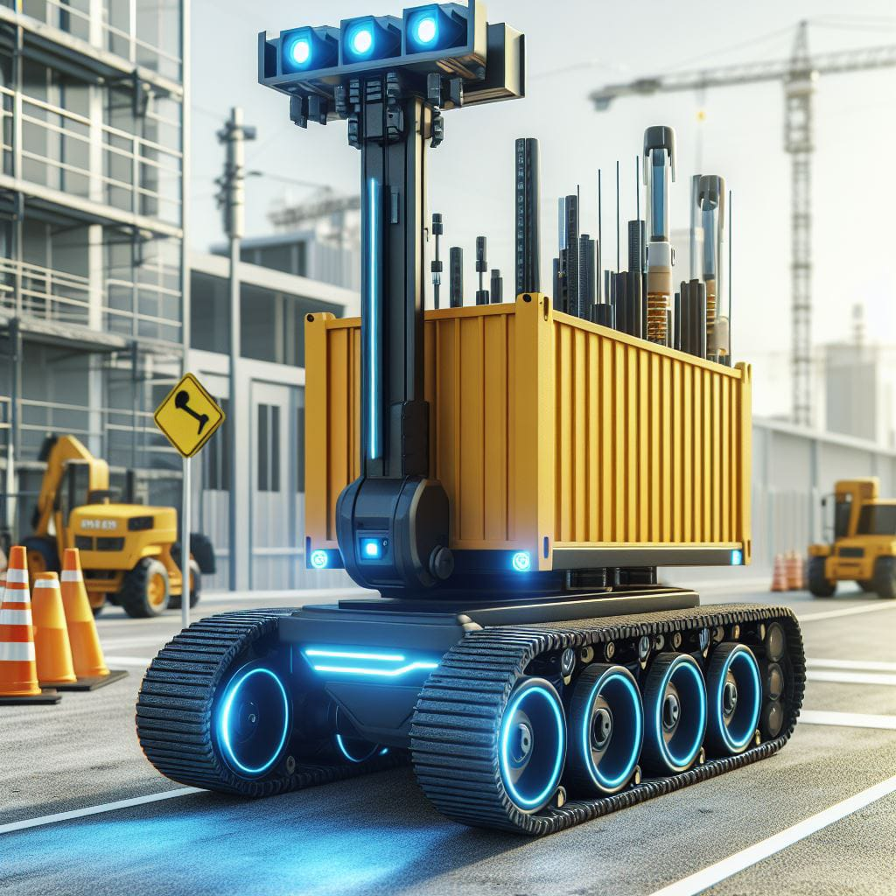

# ACAV - Autonomous Construction Aid Vehicle

ACAV (Autonomous Construction Aid Vehicle) is a design concept that uses computer vision and machine learning to aid construction workers in transporting materials based on gestures from a supervisor. The system uses a Raspberry Pi camera module to capture video frames, detects ArUco markers, and recognizes gestures using a pre-trained model trained on Teachable Machine. The system then sends commands to the cyber truck to transport materials accordingly.

 
## How It Works

The ACAV system operates as follows:

1. **Object Detection**: The ACAV system uses YOLOv3 (You Only Look Once) for real-time object detection to localize a worker within its vicinity.

2. **Worker Localization**: ArUco markers embedded in the worker's uniform are utilized for worker recognition and localization. These markers provide a unique identifier for each worker, enabling the robot to locate and track them accurately.

3. **Autonomous Following**: The robot follows predefined rules to trail the recognized worker. This includes maintaining a safe distance and adjusting its speed based on the worker's movement.

4. **Gesture-Based Communication**: Interaction between the robot and the worker is facilitated through hand gestures. A set of predefined gestures are established for communication, such as:
    - **Thumbs Up**: Command for the robot to follow the worker.
    - **High Five**: Command for the robot to stop and remain stationary.

## Features

- Real-time object detection and tracking using YOLOv4.
- Precise worker localization via ArUco markers.
- Autonomous following with predefined rules for safe interaction.
- Gesture-based communication for seamless interaction between the robot and the worker.

## Usage

### Running the Application

1. Clone this repository to your server PC.
2. Run `main.py` on the server PC.
3. Run `test_copy.py` on the Raspberry Pi with the IP address of the server PC as an argument.

## Model Training
----------------

The gesture recognition model was trained using Teachable Machine, a web-based platform for machine learning model training. The model was trained on a dataset of images and videos of the supervisor's gestures.

## Contributing

Contributions to ACAV are welcome! If you're interested in contributing to the project, please follow these guidelines:
- Fork the repository.
- Create your feature branch (`git checkout -b feature/YourFeature`).
- Commit your changes (`git commit -am 'Add some feature'`).
- Push to the branch (`git push origin feature/YourFeature`).
- Create a new Pull Request.

## License

This project is licensed under the [MIT License](LICENSE).
